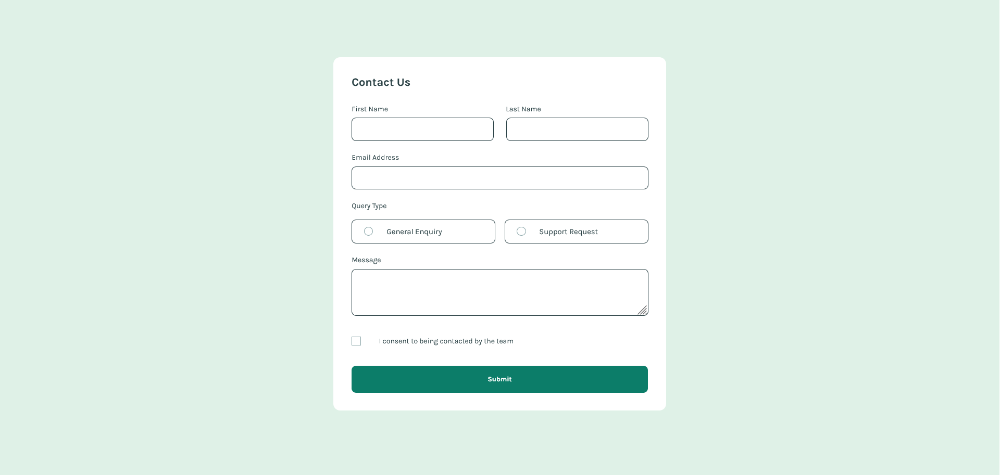

# Frontend Mentor - Contact form solution

This is a solution to the [Contact form challenge on Frontend Mentor](https://www.frontendmentor.io/challenges/contact-form--G-hYlqKJj). Frontend Mentor challenges help you improve your coding skills by building realistic projects. 

## Table of contents

- [Overview](#overview)
  - [Screenshot](#screenshot)
  - [Links](#links)
- [My process](#my-process)
  - [Built with](#built-with)
  - [What I learned](#what-i-learned)
  - [Continued development](#continued-development)
  - [Useful resources](#useful-resources)
- [Author](#author)
- [Acknowledgments](#acknowledgments)

## Overview

### Screenshot




### Links

- Solution URL: [Solution here](https://github.com/MariaCMontO/contact-form-cmo)

## My process

### Built with

- Semantic HTML5 markup
- CSS custom properties
- Flexbox
- Grid
- JavaScript

### What I learned

With this project, I learned how to include accesibily. It's important to include atributes like aria-hidden, aria-describedby, aria-polite, aria-invalid, etc. Other important fact its about input types, like radio or checkbox. When you are going to use a radio group is important to surround it with a <fieldset> and its <legend>. In this project I learned how to use toggle to change the style regarding an state, which is so useful to make thing easier.

```html
<fieldset>
          <div>
            <legend>Query Type</legend>
          </div>
          <div class="query-type-container">
            <div class="query-type">
              <label for="general-enquiry">
                <input class="" type="radio" name="query-type" id="general-enquiry"
                  aria-describedby="query-type-required">
                <span>
                  
                </span>
                General Enquiry
              </label>
            </div>
            <div class="query-type">
              <label for="support-request">
                <input class="" type="radio" name="query-type" id="support-request"
                  aria-describedby="query-type-required">
                <span>
                  
                </span>
                Support Request
              </label>
            </div>
          </div>
          <span id="query-type-required" class="is-hidden error-message" aria-live="polite"> Please select a query
            type</span>
        </fieldset>

```
```js
function textValidation(form) {
    //Selecciono todos los input de texto (nombre ,email y mensaje)
    const inputText = Array.from(form.querySelectorAll('input[type=text], input[type=email], textarea'))
    let isEmptyTotal = false;

    //Iteramos sobre cada input
    inputText.forEach((input) => {
        //Seleccionamos el error correspondiente al campo
        const error = form.querySelector(`#${input.name}-required`)
        const isEmpty = input.value.trim() === ''

        //Si algún input está vacío (isEmpty === true), entonces isEmptyTotal se vuelve true. Una vez que es true,
        // ya no vuelve a cambiar, porque el OR || no re-asigna si isEmptyTotal ya tiene valor verdadero.
        isEmptyTotal ||= isEmpty ;

        //Si el campo esta vacio, añadimos el estilo de error al input y quitamos el estilo de is-hidden del error.
        error.classList.toggle('is-hidden', !isEmpty)
        input.classList.toggle('error', isEmpty)
    })

    return !isEmptyTotal
}
```

### Continued development

I definitely want to keep developing interfaces with JavaScript functions, in order to make them more interactive.

### Useful resources

## Author

- Frontend Mentor - [@MariaCMontO](https://github.com/MariaCMontO)


## Acknowledgments
